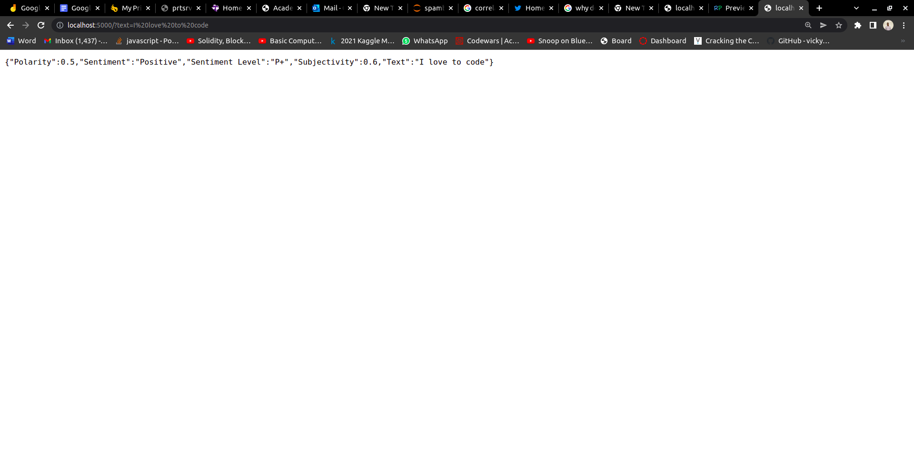
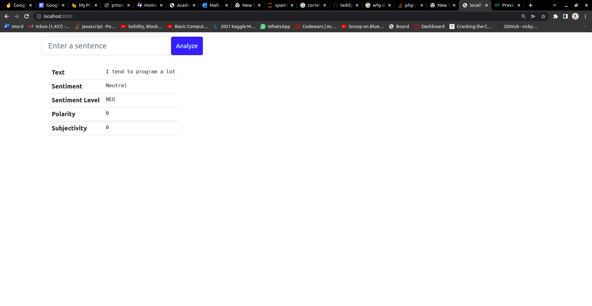
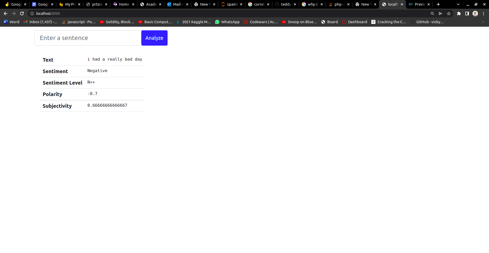

# Sentiment Analysis Api

**A Flask Sentiment Analysis API, with visual implementation**

The Sentiment Analysis Api was created using python flask module,it allows users to parse a text or sentence throught the (?text) arguement, then view the sentiment analysis of that sentence. It can be implementable into a web application.

* **Text** -The sentence to be analyzed.
* **Sentiment** -Possible outputs include,[ Positive, Neutral or Negative]
* **Sentiment Level** -Possible outputs include,[ P, P+, P++, NEU,  N, N+, N++]
* **Polarity** -Range [-1,1]
* **Subjectivity** -Range [-1,1]

 Sample Output-{"Polarity":0.5,"Sentiment":"Positive","Sentiment Level":"P+","Subjectivity":0.6,"Text":"I love to code"}
 
## Requirements

Python 3.8.5+, pipenv, Textblook, PHP

## Installation

First, clone this repository.

    $ git clone https://github.com/teddyoweh/Sentiment-Analysis-API
    $ cd Sentiment-Analysis-API

After, install all necessary to run:

    $ sudo apt install php
    $ pipenv install

## Implementation
Run the application:

	$ pipenv run python run.py

To the api output, access this url in your browser: 

	http://localhost:5000

 
To see your see implemenation of the Sentiment Analysis API:

    $ php -S localhost:8000

Then access this url in your browser: 

    http://localhost:8000

## API Output

## API Implementation

### Postive Sentiment

### Neurtal Sentiment

### Negative Sentiment

